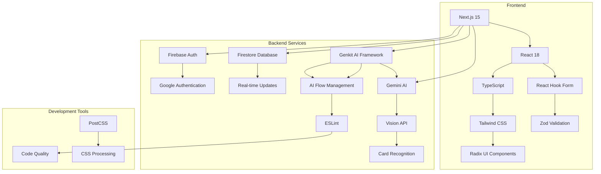

# Cardex - Pokémon Card Collection Manager

A modern web application for managing your Pokémon card collection with AI-powered card scanning and identification.

## Features

- 🤖 **AI Card Scanning**: Use Gemini Vision to automatically identify Pokémon cards from photos
- ✨ **AI Card Generation**: Create custom Pokémon cards using Google Imagen4
- 🎬 **AI Video Generation**: Bring your cards to life with animated videos using Google Veo 2.0
- 📸 **Photo-to-Card**: Transform your own photos into Pokemon cards using AI image generation
- 🔐 **Secure Authentication**: Firebase Authentication with email and Google login
- 📱 **Responsive Design**: Modern UI built with Next.js and Tailwind CSS
- 💾 **Cloud Storage**: Real-time data synchronization with Firestore
- ✏️ **CRUD Operations**: Create, read, update, and delete cards in your collection
- 🎯 **Type Safety**: Full TypeScript implementation for better development experience

## Technology Stack



## Project Structure

```
src/
├── ai/
│   └── flows/
│       ├── scan-pokemon-card.ts        # AI card scanning logic
│       ├── generate-pokemon-card.ts    # AI card generation logic
│       ├── generate-pokemon-card-from-photo.ts # Photo-to-card logic
│       └── generate-card-video.ts      # AI video generation logic
├── app/
│   ├── dashboard/
│   │   ├── collection/                 # Card collection pages
│   │   └── scan/                       # Card scanning page
│   └── page.tsx                        # Root page with auth routing
├── components/
│   ├── cards/
│   │   ├── CardForm.tsx           # Reusable card form
│   │   ├── CardItem.tsx           # Individual card display
│   │   └── CardScanner.tsx        # AI scanning component
│   └── ui/                        # Reusable UI components
├── hooks/
│   └── useAuth.tsx                # Authentication hook
├── lib/
│   ├── firebase.ts                # Firebase configuration
│   └── firestore.ts              # Database operations
└── types/
    └── index.ts                   # TypeScript type definitions
```

## Getting Started

### Prerequisites

- Node.js 18+ 
- Firebase project with Firestore and Authentication enabled
- Google AI API key for Gemini Vision, Imagen4, and Veo 2.0
- OpenAI API key for DALL-E 3 and GPT-4o (for photo-based card generation)

### Installation

1. Clone the repository:
```bash
git clone <repository-url>
cd cardex
```

2. Install dependencies:
```bash
npm install
```

3. Set up environment variables:
```bash
# Create .env.local file with:
NEXT_PUBLIC_FIREBASE_API_KEY=your_firebase_api_key
NEXT_PUBLIC_FIREBASE_AUTH_DOMAIN=your_project.firebaseapp.com
NEXT_PUBLIC_FIREBASE_PROJECT_ID=your_project_id
NEXT_PUBLIC_FIREBASE_STORAGE_BUCKET=your_project.appspot.com
NEXT_PUBLIC_FIREBASE_MESSAGING_SENDER_ID=your_sender_id
NEXT_PUBLIC_FIREBASE_APP_ID=your_app_id
GOOGLE_GENAI_API_KEY=your_gemini_api_key
OPENAI_API_KEY=your_openai_api_key
```

4. Run the development server:
```bash
npm run dev
```

5. (Optional) Start the Genkit AI development server:
```bash
npm run genkit:dev
```

## Usage

### Card Scanning
1. Navigate to the scan page
2. Upload a photo of your Pokémon card
3. Click "Scan Card" to identify the card using AI
4. Review and edit the detected information
5. Save the card to your collection

### Card Generation
1. Navigate to the generate page
2. Fill out the card parameters:
   - Pokemon name and type
   - Card properties (Full Art, Holographic)
   - Descriptions for the Pokemon and background
   - Language and optional stats
3. Click "Generate Pokemon Card" to create a custom card using AI
4. Preview the generated card
5. Save it to your collection if you like it

### Photo-to-Card Generation
1. Navigate to the "Photo Card" page
2. Upload a reference photo that will inspire the card design
3. Fill out the Pokemon details:
   - Pokemon name and type
   - Style description explaining how to adapt the photo
   - Card properties and optional stats
4. Click "Generate Pokemon Card from Photo" to create a card using your photo as reference
5. Preview the generated card that combines your photo's style with Pokemon card design
6. Save it to your collection

### Video Generation
1. Navigate to any card in your collection
2. Click "Make Card Live" to generate an animated video
3. The AI will create a 5-second video where:
   - The Pokemon comes to life and moves within the card frame
   - Sparkles, glowing effects, and type-specific elemental effects are added
   - The background has subtle movement and atmospheric effects
   - The card maintains a gentle holographic shimmer
4. Video generation may take several minutes - the page will refresh automatically
5. Once complete, you can:
   - Play the video directly in the card view
   - Download the video to your device
   - Share the animated card with others

### Collection Management
- View all your cards in a responsive grid layout
- Edit card details by clicking on any card
- Delete cards from your collection
- Cards are automatically sorted by last updated date

## Database Structure

```
Firestore Collection: users/{userId}/pokemon_cards/{cardId}
├── name: string
├── set: string
├── rarity: string
├── imageUrl: string (Firebase Storage URL)
├── videoUrl?: string (Firebase Storage URL for animated video)
├── videoGenerationStatus?: 'generating' | 'completed' | 'failed'
├── videoPrompt?: string (AI prompt used for video generation)
├── userId: string
├── createdAt: timestamp
└── updatedAt: timestamp
```

Firebase Storage Structure:
```
/users/{userId}/cards/{sanitized_card_name}_{timestamp}.png
/users/{userId}/videos/{sanitized_card_name}_{timestamp}.mp4
```

## AI Integration

The app uses multiple AI services through the Genkit framework:
- **Gemini Vision API**: Analyze uploaded card images and extract card information
- **Imagen4**: Generate custom Pokemon card artwork based on user parameters
- **Google Veo 2.0**: Create animated videos of Pokemon cards with magical effects and movements
- **OpenAI DALL-E 3**: Generate Pokemon cards based on reference photos with advanced image analysis
- **GPT-4o**: Analyze reference photos to extract visual elements for enhanced card generation
- Provide structured data for user review and confirmation

## Contributing

1. Fork the repository
2. Create a feature branch (`git checkout -b feature/amazing-feature`)
3. Commit your changes (`git commit -m 'Add amazing feature'`)
4. Push to the branch (`git push origin feature/amazing-feature`)
5. Open a Pull Request

## Scripts

- `npm run dev` - Start development server with Turbopack
- `npm run build` - Build for production
- `npm run start` - Start production server
- `npm run lint` - Run ESLint
- `npm run typecheck` - Run TypeScript type checking
- `npm run genkit:dev` - Start Genkit AI development server
- `npm run genkit:watch` - Start Genkit with file watching


## Support

For support and questions, please open an issue in the repository.
